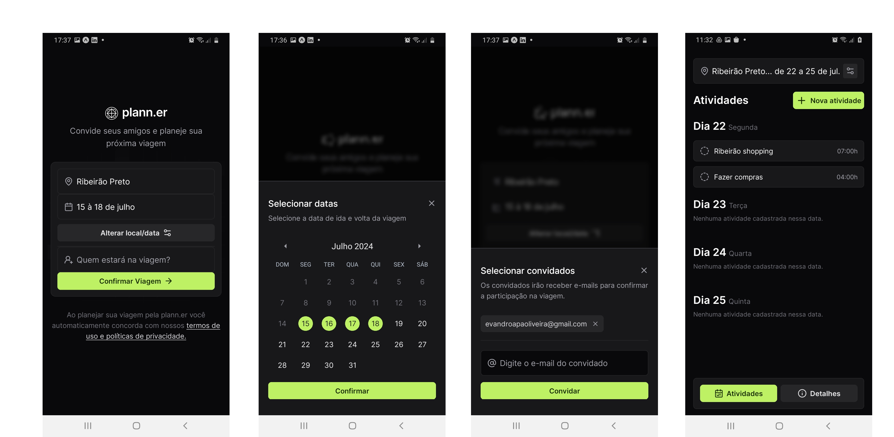

<h1 align="center"> NLW journey </h1>

Aplicação mobile para gerenciamento de viagens do NLW Journey da Rocketseat.  

  <a href="#-tecnologias">Tecnologias</a>&nbsp;&nbsp;&nbsp;|&nbsp;&nbsp;&nbsp;
  <a href="#-projeto">Projeto</a>&nbsp;&nbsp;&nbsp;|&nbsp;&nbsp;&nbsp;
  <a href="#-layout">Layout</a>&nbsp;&nbsp;&nbsp;|&nbsp;&nbsp;&nbsp;
  <a href="#memo-licença">Licença</a>

  

 

## 🚀 Tecnologias

Esse projeto foi desenvolvido com as seguintes tecnologias:

- React Native
- Expo
- Nativewind
- Node
- Axios
- zod
- sqLite
- clsx
- JavaScript
- Git e Github
- Figma

## 💻 Projeto

Aplicação mobile para gerenciamento de viagens do NLW Journey da Rocketseat

## 🎨 Layout

O layout da aplicação foi desenvolvido no [**Figma**](https://www.figma.com) pela equipe da **Rocketseat** , Você pode acessar o layout através deste link: [**Planner.er**](https://www.figma.com/community/file/1392276874471420367/nlw-journey-planejador-de-viagem
).
